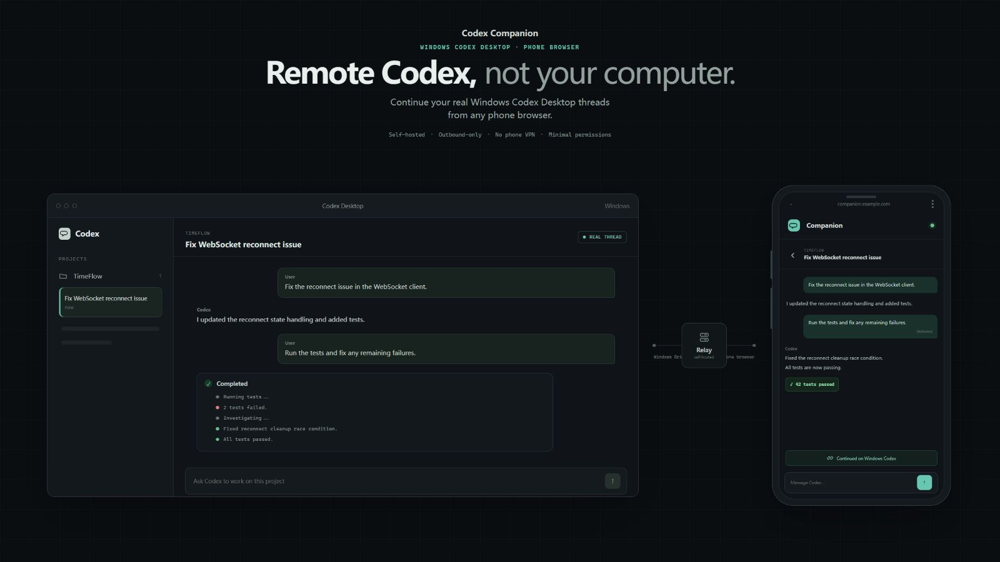

# Codex Companion

[English](./README.md) | 简体中文

**Remote Codex, not your computer.**

在任意手机浏览器中，继续 Windows Codex Desktop 中真实存在的 thread。

`自托管` · `仅出站连接` · `手机无需 VPN` · `最小权限`

[](https://github.com/znnnnnnn-wil/Codex-Companion/releases) [](LICENSE)

[](https://znnnnnnn-wil.github.io/Codex-Companion/demo/)

[▶ 查看 15 秒交互演示](https://znnnnnnn-wil.github.io/Codex-Companion/demo/)

Codex Companion 把手机浏览器连接到 Windows 电脑上已经运行的 Codex Desktop。手机通过你自己部署的 Relay 继续同一条真实 Codex thread，Windows Bridge 始终主动向外建立连接。它不提供远程桌面、任意 Shell 或通用文件 API。

## 为什么选择 Codex Companion？

### 继续真实 Codex thread

手机读取并继续的是 Windows 电脑上已经存在的 Codex thread。Codex 历史始终是真相源；Web 客户端不会另外建立一套孤立的对话数据库。

### Remote Codex，而不是整台电脑

协议只开放有限的 Codex 操作。手机不会获得整个 Windows 桌面、任意 Shell 命令、任意文件访问能力或通用键鼠控制。

### Windows 只建立出站连接

Windows Bridge 主动向 Relay 建立 WebSocket 连接。Windows 电脑不需要公网 IP、入站端口转发或 DDNS。生产部署应使用 HTTPS 和出站 WSS；快速体验模式使用 HTTP 和 WS。

### 自托管

Relay 和 Web 客户端部署在哪里由你决定。Relay 负责设备认证和受支持消息的路由。启用 PostgreSQL 时，它保存设备、配对状态和凭据哈希等元数据，不持久化完整 prompt、回复、源代码或附件正文。

## 它适合我吗？

如果你符合下面这些情况，Codex Companion 可能适合你：

- 在 Windows 上使用 Codex Desktop；
- 希望从手机检查或继续正在运行的 Codex thread；
- 更喜欢直接使用普通手机浏览器；
- 希望自己部署 Relay；
- 不希望暴露完整桌面或 Shell；或
- 不希望在手机上配置 VPN。

如果你需要完整远程桌面、从手机任意操作 Shell 或文件系统、非 Windows Codex 主机，或者官方 Codex 远程体验已经完全满足你的工作流，那么它可能并不适合你。

## 快速开始

### 前置条件

- Windows 10/11，已经安装并登录 Codex Desktop。
- 单独安装 [Codex CLI](https://github.com/openai/codex)。Bridge 无法启动 Desktop MSIX 包内受应用保护的可执行文件。
- 一台 Windows 电脑和手机都能访问的 Linux VPS，并安装 Git、curl、Docker Engine 和 Docker Compose v2.24+。

### 1. 部署 Relay

首次使用公网 IP 体验：

```bash
git clone https://github.com/znnnnnnn-wil/Codex-Companion.git /opt/codex-companion
cd /opt/codex-companion
bash scripts/install-server.sh --host YOUR_VPS_IP
```

这个快速模式使用 HTTP/WS 和内存配对数据，只适合验证功能，不建议作为暴露在公网的长期生产部署。

### 2. 配置 Windows Bridge

从 [Releases](https://github.com/znnnnnnn-wil/Codex-Companion/releases/latest) 下载并解压最新 Windows Bridge ZIP，然后在解压目录执行：

```powershell
powershell.exe -NoProfile -ExecutionPolicy Bypass -File .\install-bridge.ps1
```

按提示填写：

```text
ws://YOUR_VPS_IP/ws/bridge
```

安装器会临时以前台方式启动 Bridge，并显示一个 8 位配对码。

### 3. 配对手机

在手机浏览器打开 `http://YOUR_VPS_IP`，输入配对码。配对码十分钟后过期，并且只能使用一次。

### 4. 启动 Bridge

安装完成后，后台 Bridge 默认保持停止。请显式启动：

```powershell
$bridgeControl = "$env:LOCALAPPDATA\CodexCompanion\Bridge\bridge-control.ps1"
powershell.exe -NoProfile -ExecutionPolicy Bypass -File $bridgeControl -Action Start
powershell.exe -NoProfile -ExecutionPolicy Bypass -File $bridgeControl -Action Status
```

确认 `Running` 为 `True` 后刷新手机浏览器。

长期运行时，请配置域名、TLS、WSS 和用于持久化配对数据的 PostgreSQL，具体见[完整部署文档](docs/quickstart.md#模式-b域名-https-模式)。

## 工作方式

```text
手机浏览器 / 可选 Android App
                │
             HTTPS/WSS
                │
        自托管 Relay + Web
                │
        出站 WebSocket / WSS
                │
          Windows Bridge
                │
          Codex Desktop
```

1. Windows Bridge 主动向 Relay 建立出站连接。
2. 手机浏览器连接 Relay，请求受支持的 Codex 操作。
3. Relay 完成认证并转发 allowlist 中的消息；它不运行 Codex，也不读取项目源码目录。
4. Bridge 通过 `codex app-server` 读取真实 thread，并通过经过验证的 Codex Desktop UI Automation 发送消息。
5. 真实 Codex thread 始终是对话真相源。Bridge 轮询活跃历史，并把已经确认的变化流式同步到手机。

实现细节见[架构说明](docs/architecture.md)和 [WebSocket 协议](docs/protocol.md)。

## 它和其他方式有什么不同？

| | Codex Companion | 远程桌面 | VPN + 本地服务 |
| --- | --- | --- | --- |
| 主要范围 | 受支持的 Codex 操作 | 完整桌面会话 | 取决于本地服务开放的能力 |
| 继续真实 Codex thread | 是 | 通过桌面间接完成 | 取决于服务 |
| 是否需要完整桌面权限 | 否 | 是 | 否 |
| 手机是否需要 VPN | 否 | 取决于产品和部署方式 | 是 |
| Windows 是否需要公网入站端口 | 否 | 取决于部署方式 | 否 |
| 任意 Shell 或文件访问 | 否 | 桌面级访问 | 取决于服务 |
| 自托管 Relay | 是 | 取决于产品 | 不适用 |

Codex Companion 无意取代 OpenAI 官方远程体验。它主要面向明确需要自托管、浏览器优先、出站 Relay 架构，并希望维持窄权限边界的用户。

## 安全模型

### Codex Companion 允许什么

Web 到 Bridge 的 allowlist 支持：

- 列出并读取真实 Codex thread；
- 只在从真实 thread 中已经观察到的项目路径内新建 thread；
- 发送文本和用户主动选择的附件；
- 读取真实 thread 中经过验证的生成图片和仍然可用的图片附件；
- 停止唯一定位的 Codex Desktop thread 中正在执行的工作。

### 它刻意不开放什么

- 任意 Shell 执行；
- 任意文件系统读写；
- 完整远程桌面或屏幕流；
- 通用键盘、鼠标控制；
- 在经过验证的 Codex Desktop 窗口之外执行不受限制的 UI Automation。

### 连接与数据模型

Bridge 主动连接 Relay。Relay 在内存中维护请求关联和消息路由。配置 PostgreSQL 后，数据库保存设备、配对状态和 SHA-256 凭据哈希。离线 prompt 不会排队，Relay 不持久化完整 prompt、回复、源代码和附件正文。

### 配对与凭据

配对使用 8 位、只能使用一次、十分钟有效的配对码。Bridge 和 Web 分别获得独立生成的 256-bit token；Relay 只保存哈希。Windows 使用 DPAPI 保护 Bridge 凭据。可选 Android App 使用 Keystore 支持的安全存储；普通浏览器使用浏览器本地存储。

这些设计缩小了暴露的能力范围，但不能替代 VPS、TLS、数据库、浏览器和 Windows 账号本身的安全配置。将服务暴露到公网前，请阅读完整的[安全模型](docs/security.md)。

## 当前能力

- **Windows Bridge（.NET 10）：**真实 `thread/list`、`thread/read` 和 `thread/start`；经过验证的 Desktop 消息发送；历史确认；状态轮询；停止控制；附件暂存；Relay 自动重连。
- **Relay（Go）：**配对、凭据认证、WebSocket 路由、请求关联、连接状态、显式消息 allowlist、内存或 PostgreSQL 元数据存储。
- **Web 客户端（React/Vite）：**移动端优先的 thread 列表和聊天、在已知项目路径中新建 thread、Markdown/GFM、流式更新、pending 到 confirmed 对账、附件、生成图片、停止控制和重连状态。
- **可选 Android App（Capacitor）：**使用同一套 Web 客户端，并通过 Keystore 支持的存储保护凭据。

Codex Companion 当前面向 Windows Codex Desktop。它不提供模型供应商切换、Git UI、多 Agent 编排、企业级权限系统或独立云端 AI 后端。模型和账号仍由真实 Codex Desktop thread 决定。

## Web 与 Android

手机浏览器是推荐客户端，无需安装 App。Android 包是可选封装，与 Web 使用相同源码。Android Release 构建要求 HTTPS/WSS 部署，并显式配置 Relay Origin。

Android 构建命令和限制见[开发文档](docs/development.md#可选-android-app)。

## 开发

仓库包含四个主要部分：

- `apps/bridge` — Windows Bridge 与 Codex Desktop 集成；
- `services/relay` — Relay、配对、路由和存储；
- `apps/web` — 浏览器客户端、可选 Android 封装与产品 Demo；
- `deploy` — Docker Compose、Nginx 与 Caddy 部署配置。

常用检查：

```powershell
cd apps/web
npm test
npm run lint
npm run build
```

```powershell
cd services/relay
go test ./...
```

```powershell
dotnet test CodexCompanion.slnx
```

本地服务启动、工具链要求、Android 构建和诊断命令见[开发文档](docs/development.md)。

## 常见问题

### Codex Companion 会运行自己的 AI 模型吗？

不会。Relay 不配置独立后端模型，也不要求 OpenAI API Key。实际工作继续发生在 Windows 电脑上的真实 Codex Desktop thread 中，使用该 Codex 账号和 thread 配置。

### 手机需要 VPN 吗？

不需要。手机和 Windows 电脑只需要能够访问你部署的 Relay。生产环境应通过 HTTPS/WSS 暴露 Relay。

### Relay 会保存对话或源代码吗？

当前 Relay 实现不会持久化完整 prompt、回复、源代码或附件正文，但会在内存中处理正在路由的 WebSocket 消息。启用 PostgreSQL 后，数据库保存设备、配对状态和凭据哈希等元数据。

### 可以把它当作远程桌面或 SSH 使用吗？

不可以。这些能力被明确排除在协议之外。

### 必须安装 Android App 吗？

不需要。普通手机浏览器是推荐入口；Android 只是同一套 Web 客户端的可选封装。

## 文档

- [快速部署](docs/quickstart.md)
- [公网部署与验收记录](docs/deployment.md)
- [安全模型](docs/security.md)
- [架构与真相源](docs/architecture.md)
- [WebSocket 协议](docs/protocol.md)
- [开发文档](docs/development.md)
- [Codex Desktop 集成研究](docs/codex-research.md)

## 许可证

Codex Companion 使用 [MIT License](LICENSE) 开源。
